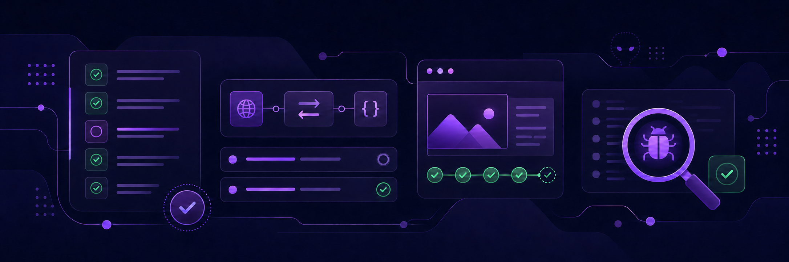

  

# Olá, eu sou o Gustavo Alves Moreno! 👋

### QA Júnior | Testes manuais | API | Automação E2E

[Português](#-sobre-mim) • [English](#english-version)

## 👨‍💻 Sobre mim

Estou em transição para a área de **Qualidade de Software** e busco minha primeira oportunidade como **QA Júnior, estágio em QA ou Analista de Testes Júnior**.

Concluí a formação livre em Engenharia de Qualidade de Software pela EBAC e estou matriculado no curso de Análise e Desenvolvimento de Sistemas da Faculdade Impacta, com início previsto para agosto de 2026.

Tenho colocado os estudos em prática por meio de projetos acadêmicos que envolvem planejamento e documentação de testes, cenários positivos e negativos, testes manuais, API, automação E2E, performance, mobile, CI/CD e evidências de execução.

Antes da transição, atuei por mais de cinco anos na área administrativa. Essa experiência fortaleceu minha organização, atenção aos detalhes, responsabilidade, comunicação e cuidado com documentação — habilidades que também levo para QA.

## 🧪 O que venho praticando

- Planejamento e documentação de cenários, casos de teste, critérios de aceitação e evidências.
- Testes manuais, funcionais, regressivos e exploratórios.
- Validação de APIs, autenticação, contratos, dados dinâmicos e cenários positivos e negativos.
- Automação web E2E, organização de testes e uso de Page Objects.
- Testes de performance e automação mobile em projetos acadêmicos.
- CI/CD, relatórios de execução e publicação de evidências.
- Uso de IA e engenharia de prompts como apoio à análise de requisitos, criação de cenários e automação, sempre com revisão e validação.

## 🚀 Projetos em destaque

- **[TCC-QA-EBAC](https://github.com/Guss182/TCC-QA-EBAC)**  
  Projeto final da formação em Engenharia de Qualidade de Software da EBAC, reunindo automações de UI, API, mobile e performance, além de documentação, evidências e integração contínua.  
  `Cypress` `Supertest` `Mocha/Chai` `Appium` `WebdriverIO` `k6` `GitHub Actions` `Allure`

- **[Hub de Leitura — QA Automation Lab](https://github.com/Guss182/hub-leitura-qa-automation-lab)**  
  Laboratório acadêmico de QA com automação E2E em Cypress, validação via Playwright MCP, QA Agent, prompts, documentação e evidências.  
  `Cypress` `Playwright MCP` `JavaScript` `QA Agent` `Prompt Engineering`

- **[E2E-CI-CD-EBAC](https://github.com/Guss182/E2E-CI-CD-ebac)**  
  Automação E2E com Cypress e pipeline no GitHub Actions, incluindo relatório Allure, publicação no GitHub Pages e armazenamento de evidências.  
  `Cypress` `GitHub Actions` `CI/CD` `Allure Report` `GitHub Pages`

- **[Automação de API — Módulo 14](https://github.com/Guss182/Teste-Api-Modulo14-EBAC)**  
  Automação de testes de API no ServeRest, cobrindo cenários positivos e negativos, autenticação, validação de schema e geração de dados dinâmicos.  
  `Cypress` `JavaScript` `Joi` `Faker` `ServeRest`

- **[Testes de API com Postman — Módulo 13](https://github.com/Guss182/Teste-API-Modulo13-QA-EBAC)**  
  Coleção de testes da API Hub de Leitura, cobrindo autenticação, usuários, catálogo de livros e reservas com cenários positivos e negativos.  
  `Postman` `API REST` `HTTP` `JavaScript` `Testes de API`

## 🛠️ Tecnologias e ferramentas

  
  
  
  
  
  
  
  
  
  

As ferramentas que mais utilizei nos projetos em destaque foram **Cypress, Postman, JavaScript, Git/GitHub, GitHub Actions e Allure Report**. Também tive contato prático, principalmente em atividades acadêmicas, com **Playwright MCP, Supertest, Mocha/Chai, PactumJS, Appium, WebdriverIO, JMeter, k6, Docker, MongoDB e fundamentos de SQL/NoSQL**.

### Atualmente estudando

- Playwright e integração com MCP.
- Jira, Zephyr e Azure DevOps.
- IA e engenharia de prompts aplicadas à Qualidade de Software.
- Salesforce Administration por meio do Trailhead, como conhecimento complementar.

## 🎓 Formação

- **Engenharia de Qualidade de Software — EBAC**  
  Formação livre concluída em março de 2026.

- **Análise e Desenvolvimento de Sistemas — Faculdade Impacta**  
  Matrícula ativa, com início previsto para agosto de 2026.

- **Inglês**  
  Leitura e compreensão em nível avançado, com conversação em desenvolvimento.

---

<strong>🌎 Read the complete profile in English</strong>

 

## 👨‍💻 About me

I am transitioning into **Software Quality Assurance** and looking for my first opportunity as a **Junior QA, QA Intern, or Junior Test Analyst**.

I completed a professional training program in Software Quality Engineering at EBAC and am enrolled in the Systems Analysis and Development program at Faculdade Impacta, starting in August 2026.

I have been putting my studies into practice through academic projects involving test planning and documentation, positive and negative scenarios, manual testing, API testing, E2E automation, performance, mobile, CI/CD, and test evidence.

Before transitioning into technology, I worked for more than five years in administrative roles. This experience strengthened my organization, attention to detail, responsibility, communication, and documentation skills — qualities I also bring to QA.

## 🧪 What I have been practicing

- Planning and documenting test scenarios, test cases, acceptance criteria, and evidence.
- Manual, functional, regression, and exploratory testing.
- API validation, authentication, contracts, dynamic data, and positive and negative scenarios.
- E2E web automation, test organization, and Page Objects.
- Performance testing and mobile automation in academic projects.
- CI/CD, test reports, and evidence publishing.
- Using AI and prompt engineering to support requirements analysis, scenario creation, and automation, always followed by review and validation.

## 🚀 Featured projects

- **[TCC-QA-EBAC](https://github.com/Guss182/TCC-QA-EBAC)**  
  Final project from the EBAC Software Quality Engineering program, combining UI, API, mobile, and performance automation with documentation, evidence, and continuous integration.  
  `Cypress` `Supertest` `Mocha/Chai` `Appium` `WebdriverIO` `k6` `GitHub Actions` `Allure`

- **[Hub de Leitura — QA Automation Lab](https://github.com/Guss182/hub-leitura-qa-automation-lab)**  
  Academic QA lab with Cypress E2E automation, Playwright MCP validation, a QA Agent, prompts, documentation, and evidence.  
  `Cypress` `Playwright MCP` `JavaScript` `QA Agent` `Prompt Engineering`

- **[E2E-CI-CD-EBAC](https://github.com/Guss182/E2E-CI-CD-ebac)**  
  Cypress E2E automation with a GitHub Actions pipeline, Allure reports, GitHub Pages publishing, and test evidence storage.  
  `Cypress` `GitHub Actions` `CI/CD` `Allure Report` `GitHub Pages`

- **[API Automation — Module 14](https://github.com/Guss182/Teste-Api-Modulo14-EBAC)**  
  Automated API tests for ServeRest covering positive and negative scenarios, authentication, schema validation, and dynamic test data.  
  `Cypress` `JavaScript` `Joi` `Faker` `ServeRest`

- **[API Testing with Postman — Module 13](https://github.com/Guss182/Teste-API-Modulo13-QA-EBAC)**  
  Hub de Leitura API collection covering authentication, users, the book catalog, and reservations with positive and negative scenarios.  
  `Postman` `REST API` `HTTP` `JavaScript` `API Testing`

## 🛠️ Technologies and tools

The tools I used most frequently in the featured projects were **Cypress, Postman, JavaScript, Git/GitHub, GitHub Actions, and Allure Report**. I have also had hands-on contact, mainly through academic activities, with **Playwright MCP, Supertest, Mocha/Chai, PactumJS, Appium, WebdriverIO, JMeter, k6, Docker, MongoDB, and SQL/NoSQL fundamentals**.

### Currently studying

- Playwright and MCP integration.
- Jira, Zephyr, and Azure DevOps.
- AI and prompt engineering applied to Software Quality Assurance.
- Salesforce Administration through Trailhead as complementary knowledge.

## 🎓 Education

- **Software Quality Engineering — EBAC**  
  Professional training program completed in March 2026.

- **Systems Analysis and Development — Faculdade Impacta**  
  Enrolled, starting in August 2026.

- **English**  
  Advanced reading and comprehension, with conversational skills in development.

---

## 📫 Contato

Estou aberto a oportunidades de entrada em QA e também a conversas sobre testes, automação e qualidade de software.

- [LinkedIn](https://www.linkedin.com/in/gustavo-alves-moreno/)
- [E-mail profissional](mailto:gustavo.182m@gmail.com)
- [Trailhead Salesforce](https://www.salesforce.com/trailblazer/gusmoreno)

**Obrigado pela visita!**

